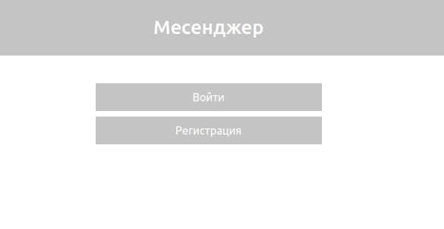
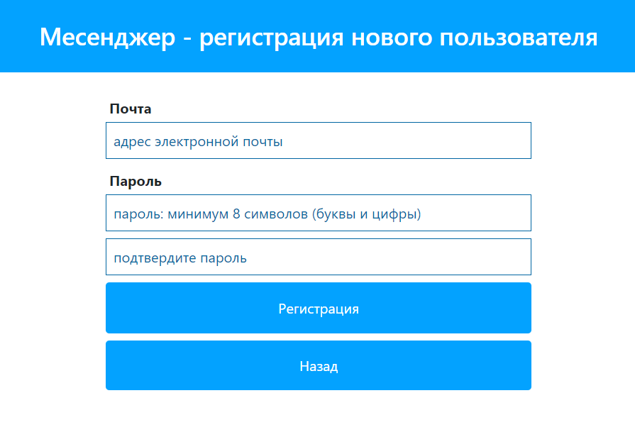
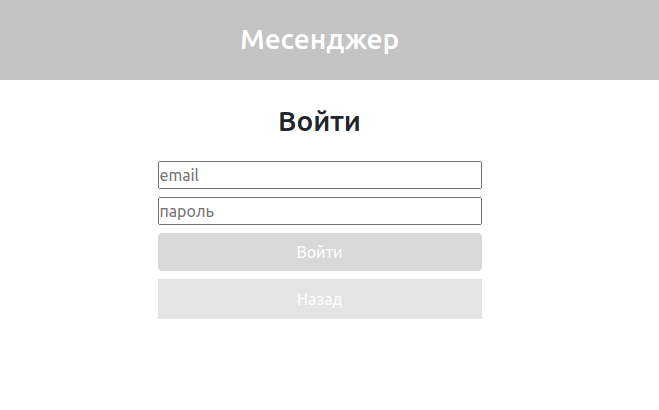
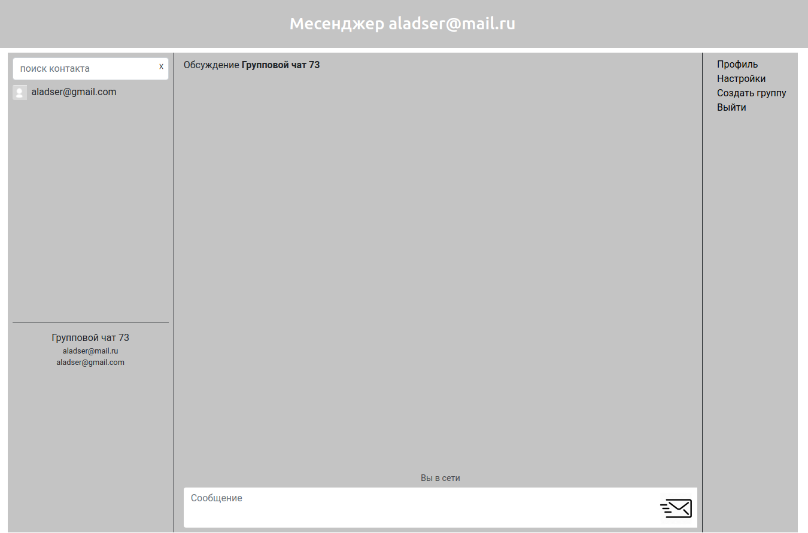
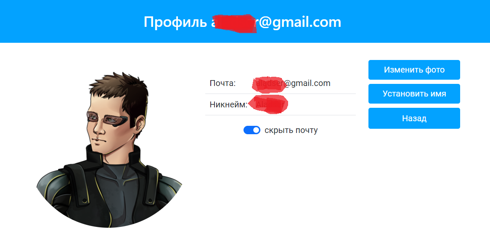
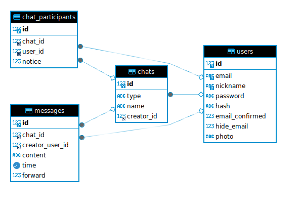

# Мессенджер

Мессенджер с использованием вебсокетов (библиотека Ratchet)

* Сайт сделан на основе **MVC-фреймворка**.
* В качестве асинхронного общения между клиентом и сервером используется **вебсокет**: встроенная **JS-библиотека** и **PHP Ratchet**.
Обмен сообщениями происходит с помощью php-класса ``Aladser\Core\Chat`` и JS-файла *chats.js*
* Название MySQL БД: **messenger**. 
* Из-за ограничений MySQL используются триггеры на добавление сообщения и создание чата: проверка пользователя-отправителя и типа чата. 
* Для отправки почты используются **phpmailer**, **mail.ru SMTP-сервер**. За отправку писем отвечает класс ``Aladser\Core\EMailSender``
* Конфигурация сайта находится в **/application/Core/ConfigClass.php**, в классе *Aladser\Core\ConfigClass*
* Взаимодействие между фронтом и бэком: фронт делает запрос к данным в БД через соответстующие классы моделей таблиц в пространстве имен *Aladser\Models*.
  + ``DBTableModel`` - абстрактная модель БД таблицы
  + ``DBQueryCtl`` - делает запросы в БД
  + ``UsersDBTableModel`` - модель БД таблицы пользователей
  + ``MessageDBTableModel`` - модель БД таблицы сообщений
  + ``ContactsDBTableModel``- модель БД таблицы контактов
  + ``ConnectionsDBTableModel`` - модель БД таблицы соединений пользователей
* *boostrap.php* - запуск сайта и бэка вебсокета, *
* *chat-server.php* - запуск бэк-вебсокета
* Изображения профилей хранятся в */application/data/profile_photos*. Когда выбирается файл изображения в проводнике, временно файл загружается в */application/data/temp*. При сохранении файл перемещается в profile_photos
* Авторизация пользователя сохраняется в куки без возможности отключения
* есть файлы логов сервера Apache, вебосокета, парсинга PID-процессов Linux в папке *logs*

### Структура сайта

+ Главная страница



+ Регистрация нового пользователя



+ Авторизация



+ Чаты



+ Профиль



### Структура БД:

  + пользователи ``users``
  + контакты пользователей ``contacts``
  + соединения ``connections``
  + чаты ``chat``
  + участники чатов ``chat_participant``
  + сообщения чатов ``chat_message``
  + неподтвержденные электронный почты ``unhidden_emails``

### Интерфейс
* При получении нового сообщения пользователем чат отправителя подсвечивается серым цветом.


* Принятие, изменение, пересылка и удаление сообщений происходит через вебсокет.


* при получении сообщения можно включить звуковые уведомления.


* Если вебсокет недоступен, то перед отправкой сообщения вылезет предупреждение. По умолчанию вебсокет висит на localhost.


* Создание чатов контактов и групповых чатов, добавление сообщений в БД совершается через процедуры.
* В групповой чат любой участник может добавить нового участника.


* Пользователь в БД ищется по публичной почте или никнейму.

* можно удалять контакты и группы. Группу может удалить любой участник (администратор группы недоделан).

### Разворачивание сайта

* Файл конфига Apache. Предполагается, что сайт лежит в папке */var/www*

```
<VirtualHost *:80>
        ServerName messenger.local
        DocumentRoot /var/www/messenger.local
        ErrorLog /var/www/messenger.local/logs/error.log
        CustomLog /var/www/messenger.local/logs/access.log combined
        <Directory /var/www/messenger.local>    
                Options Indexes FollowSymLinks               
                AllowOverride All               
                Require all granted    
        </Directory>      
</VirtualHost>
```

* Установить модуль: 

``apt-get install php8.1-mysql``

* Активировать модуль Apache: 

``sudo a2enmod rewrite``

* в папке *storage/dumps* SQL-код для создания таблиц и процедур